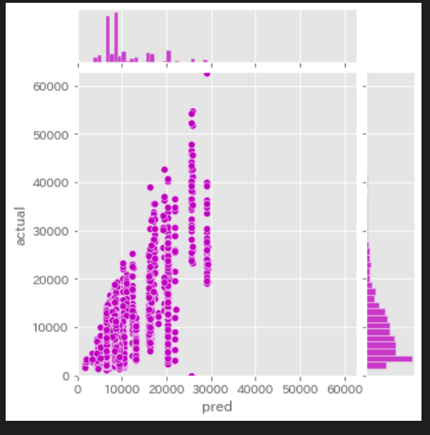

<!-- omit in toc -->
# MarkDown使い方
- [見出し1](#見出し1)
  - [見出し2](#見出し2)
    - [見出し3](#見出し3)
  - [太字、斜体](#太字斜体)
  - [リスト(ドット)](#リストドット)
  - [リスト(ナンバリング)](#リストナンバリング)
  - [チェックボックス](#チェックボックス)
  - [斜め (*で囲う)](#斜め-で囲う)
  - [太字 (**で囲う)](#太字-で囲う)
  - [斜め太字 (***で囲う)](#斜め太字-で囲う)
  - [取り消し線 (~~で囲う)](#取り消し線-で囲う)
  - [表(テーブル)](#表テーブル)
    - [コードエリアを右クリックし「ドキュメントのフォーマット」を選ぶと、整形されコードウィンドウが見やすくなる。](#コードエリアを右クリックしドキュメントのフォーマットを選ぶと整形されコードウィンドウが見やすくなる)
    - [Markdown表変換ツール](#markdown表変換ツール)
  - [引用](#引用)
  - [数式](#数式)
    - [数式の書き方 *ブラウザでうまく表示できていない。VScodeで確認する*](#数式の書き方-ブラウザでうまく表示できていないvscodeで確認する)
  - [ソースコード(インライン)](#ソースコードインライン)
  - [Webリンク](#webリンク)
  - [画像を入れる](#画像を入れる)
  - [画像を横ならびにする](#画像を横ならびにする)
  - [目次の作成](#目次の作成)
  - [目次の更新](#目次の更新)
  - [目次に含めない](#目次に含めない)

## 拡張機能
Markdown All in One

## 改行
行末にスペースを２つ入れてから改行すると適用されます。
２行以上改行すると、スペースなしでも改行されます。

___
## 水平線
セクションの区切りなどに用いる水平線は、
アスタリスクやアンダーラインを３つ以上入力すると表現できます。
どちらでも意味合いは同じなので、お好きな方をお使いください。
セクション１
***
セクション２
___
セクション３
___
## 見出し
シャープの数で見出しのレベルを決める
# 見出し1
## 見出し2
### 見出し3
___
## 太字、斜体
アスタリスクの数で表す
*斜体*
**太字**
___
## リスト(ドット)
アスタリスクの後にスペースが入ります。
インデントしたい場合は、文頭にスペースを2つ入れます。
* リスト1
* リスト2
* リスト3
* スペース2つで子アイテムになる
___
## リスト(ナンバリング)
全て１で指定しても、自動ナンバリングされます。
アイテムを追加削除しても自動でナンバリングされるので便利です。
こちらもピリオドの後にスペースが必要になります。
1. リスト1
1. リスト2
1. リスト3
___
## チェックボックス
作業内容の進捗を表すときなどに便利なチェックボックスを表現することもできます。
アルファベットのxを入れると、チェックを入れることができます。
-  帰宅後
   - [ ] うがい
   - [x] 手洗い
___
## 斜め (*で囲う)
文字の出力は*print*を使う
___
## 太字 (**で囲う)
文字の出力は**print**を使う
___
## 斜め太字 (***で囲う)
文字の出力は***print***を使う
___
## 取り消し線 (~~で囲う)
文字の出力は~~print~~を使う
___
## 表(テーブル)
タイトルと項目の間の区切り線の両端にコロンを入れると、その列の文字配置を指定できます。
| 左寄せ(デフォルト) |            中央揃え            |                     右寄せ |
| ------------------ | :----------------------------: | -------------------------: |
| その１             | コロンでラインを挟むと中央揃え | 右側にコロンを書くと右寄せ |
| その２             |             実践編             |                     実践編 |
| その３             |             発展編             |                     発展編 |
### コードエリアを右クリックし「ドキュメントのフォーマット」を選ぶと、整形されコードウィンドウが見やすくなる。
### Markdown表変換ツール
[リンク](https://markdown-convert.com/ja/tool/table)
Excel、CSVなどを表変換してくれる


___
## 引用
> 引用しました
>> 引用の引用です
>>> さらに引用
と、このように引用を表すことができます
___
## 数式
数式は基本的に`LaTeX`の記法で記述

### 数式の書き方 *ブラウザでうまく表示できていない。VScodeで確認する*
- **インライン数式**（文章内に埋め込まれる数式） `$数式$`　`$`で囲う<br>
$x=3$
```python
$x=3$
```
- **ディスプレイ数式** `$$`で上下の行を囲う<br>
$$
\frac{a}{b}
$$
```python
$$
\frac{a}{b}
$$
# $$で一行使わないとうまくいかない。
```

$$y=3\times{2}{x^2}$$
```python
$$
\frac{a}{b}
$$

数式は基本的にLaTeXの記法で記述する。例えば分数a/bをインライン数式で書きたかったら、

$\frac{a}{b}$
のように書く。

数式の等号のそろえ方
ディスプレイ数式について、数式が複数行にわたる場合、 等号をそろえたければ以下のように記述する。

$$
\begin{aligned}
数式 &= 数式 \\
&= 数式
\end{aligned}
$$
$$y=3\times{2}{x^2}$$
$$y=3$$
$$\times$$
$$frac{2}{x^2}$$
$${x^2}$$

|                  |                  |                                          |
| ---------------- | ---------------- | ---------------------------------------- |
| $$y=3$$          | 数式　`$$`で囲う | `$$`y=3`$$`                              |
| \times           | ✖️                | `\times`                                 |
| $$frac{2}{x^2}$$ | 分数             | `frac{`分子`}{`分母`}`      frac{2}{x^2} |
| $${x^2}$$        | 乗               | `{x^`2`}`                                |
___
## ソースコード(ブロック)
コードブロックの始まりの行に言語を指定するキーワードを入れると、シンタックスハイライトが効く
コードを記載します
```python
N = 'ソースコード'
print(N)
```
___
## ソースコード(インライン)
変数名などを文中で使いたい場合に便利なインラインのコードを表現するにはシングルクォーテーションで括る。
この値は`strValue`という変数に格納されています
___
## Webリンク
角括弧に文字列を入れると、リンクのラベルを付けることができます。
[Googleへのリンク](https://google.co.jp)
`[Googleへのリンク](https://google.co.jp)`
___
## 画像を入れる
画像を挿入するには、画像のURLを入れます。
(下記画像URLはサンプルですので、画像URLは適宜変更ください)


スクショをとる shift + command + 4
Findarでファイルを開いて、command + c
貼り付けたい場所で option + command + v


設定：settings.json
{
    "markdown.preview.breaks": true,
    "markdown.preview.fontSize": 18,
    "pasteImage.path": "img",
    "pasteImage.insertPattern": "",
}

## 画像を横ならびにする
`<p>`で囲む
```html
<p>
  
  
  
</p>
```
<p>
  
  
  
</p>
横並びできた。


___
## 目次の作成
command+shift+p -> Markdown All in One: Create Table of Contents

## 目次の更新
command+Sで保存- [MarkDown使い方](#markdown使い方)

## 目次に含めない

<!-- omit in toc -->
# MarkDown使い方
