- [Microsoft Edge for macOS](#microsoft-edge-for-macos)
  - [ダウンロードからエクセル操作まで](#ダウンロードからエクセル操作まで)
  - [初期設定](#初期設定)
  - [エクセルの導入](#エクセルの導入)
# Microsoft Edge for macOS
## ダウンロードからエクセル操作まで

[Edge for macOS ダウンロードリンク](https://www.microsoft.com/ja-jp/edge)

下に移動して、mac用を選択する
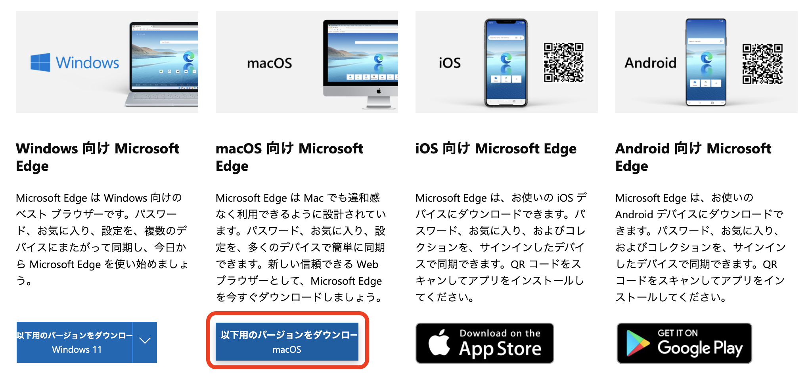

ダウンロードするときにアーキテクチャを選択する画面が表示されます。
ダウンロードボタンを選択する
ダウンロード完了したら、インストールする

  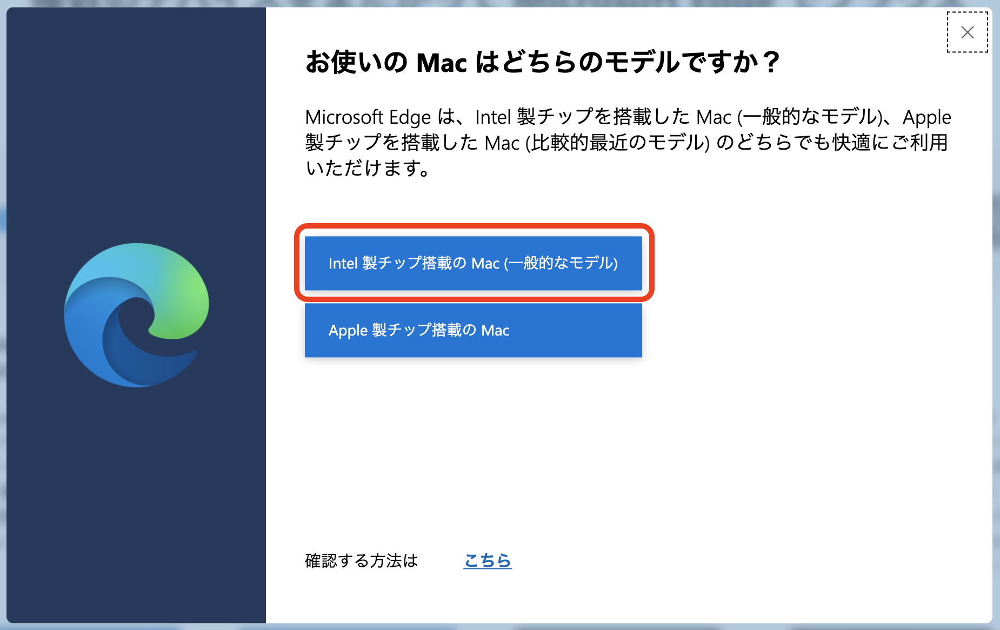
  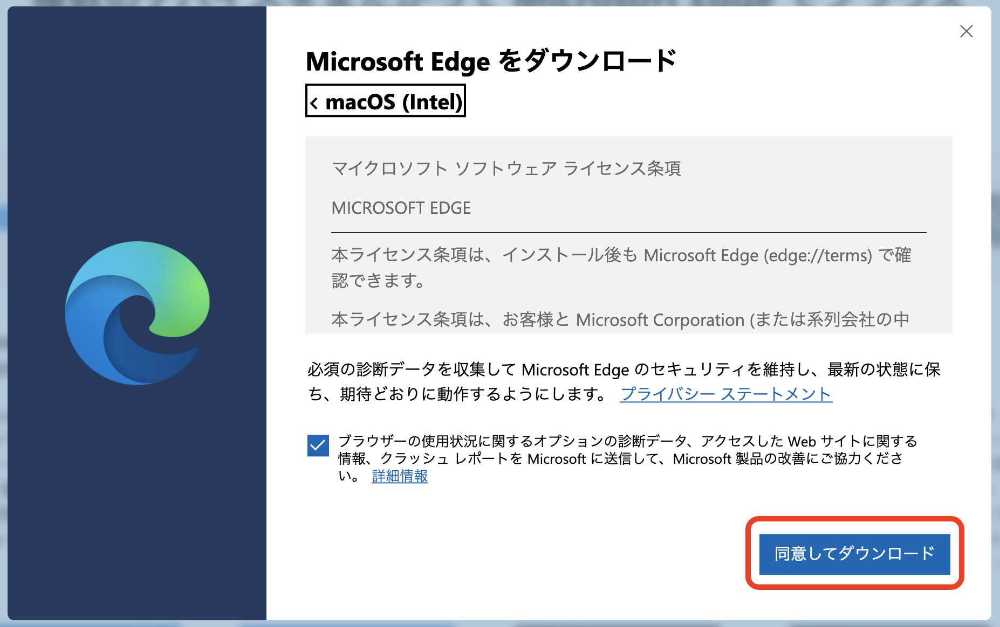
  

  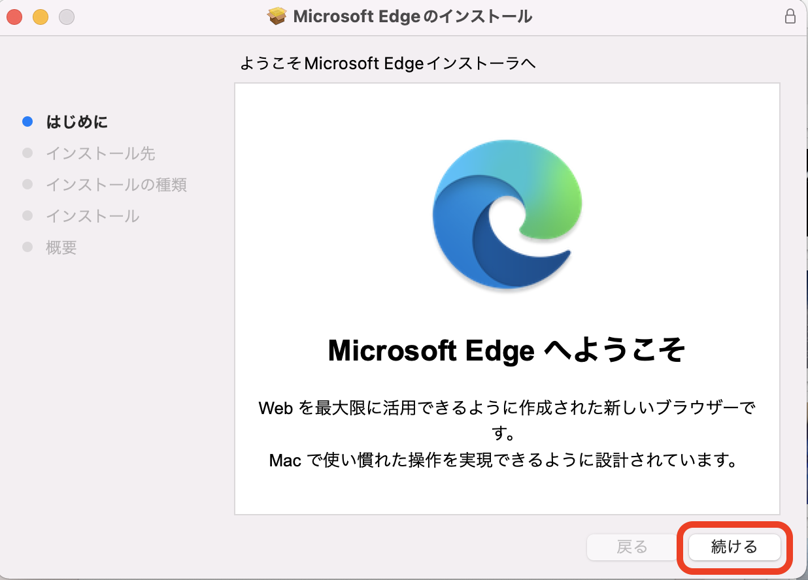
  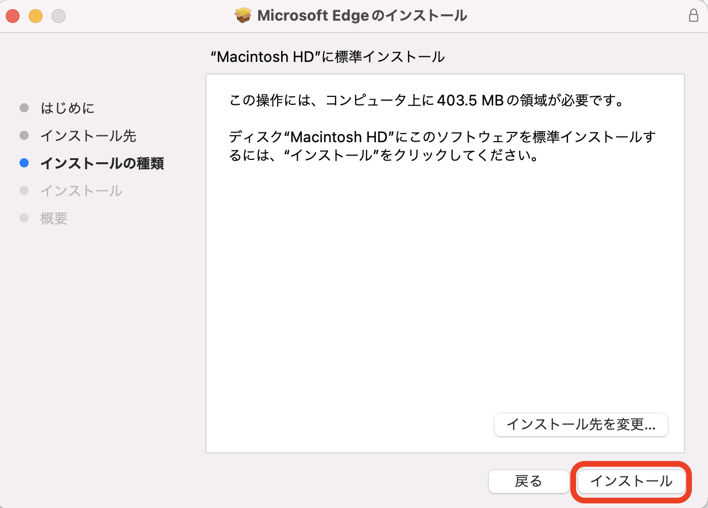

  
  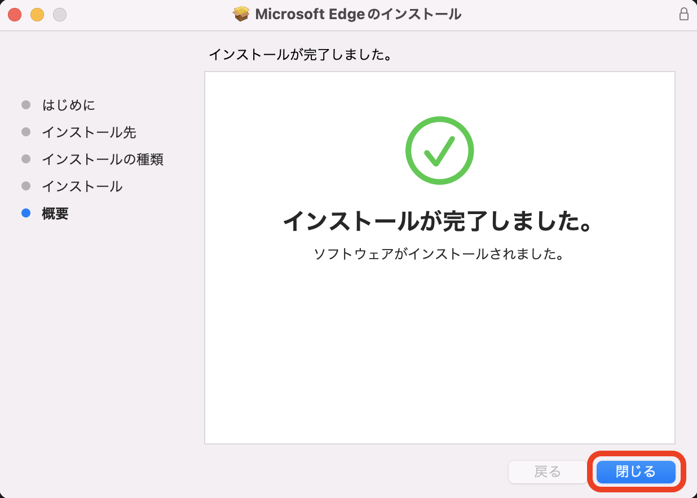

## 初期設定
トップページのデザインを選択したり、など初期設定はお好みで。

## エクセルの導入
[詳細]ボタンをクリックして[拡張機能]を選択
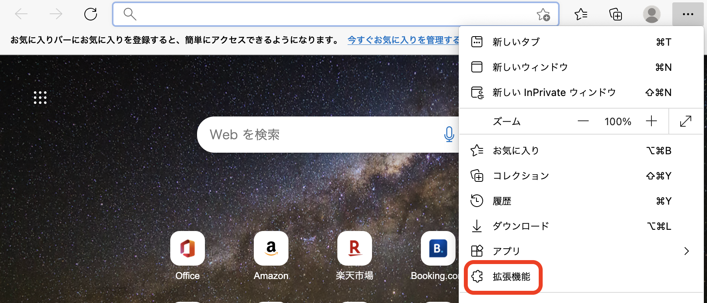

「Office Online」を検索し、Officeをインストールする
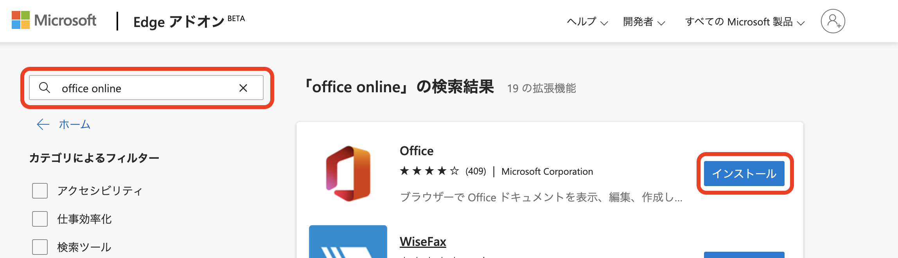

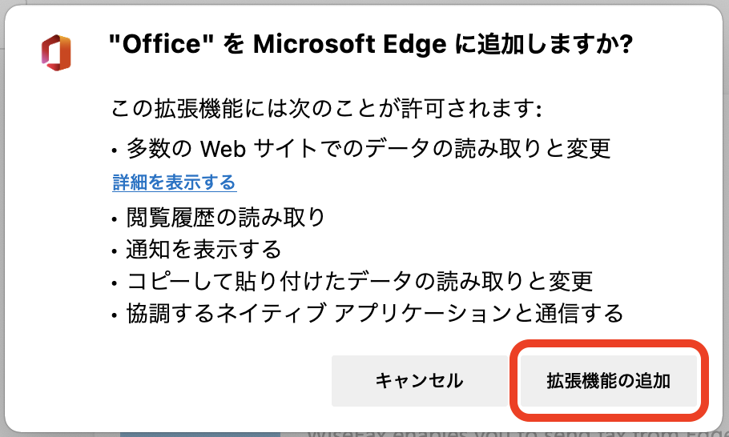

このページが出てくる。サインインする
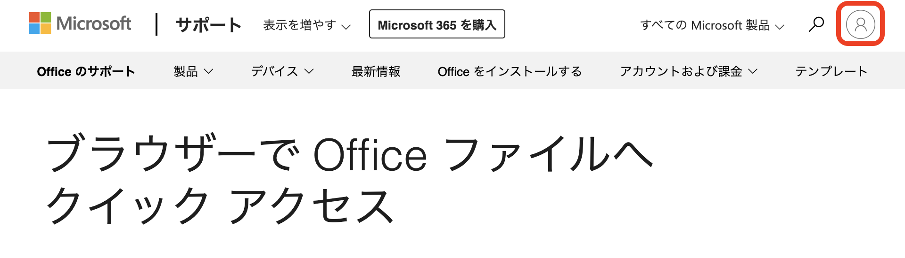

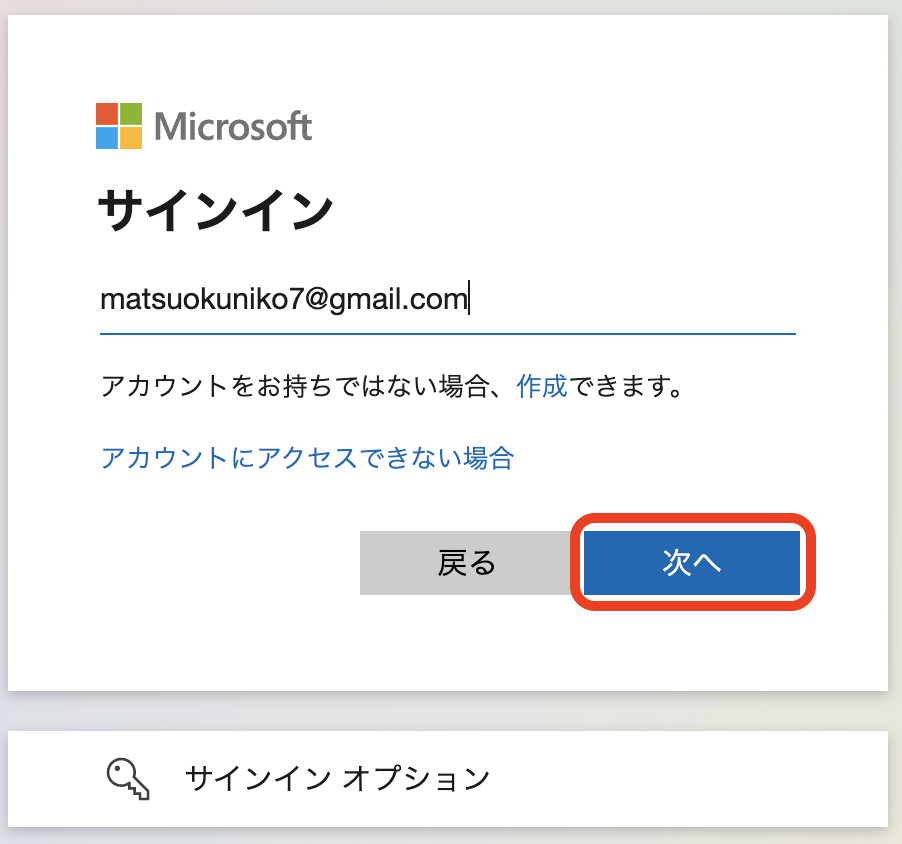

右上のオフィスのマークを選択
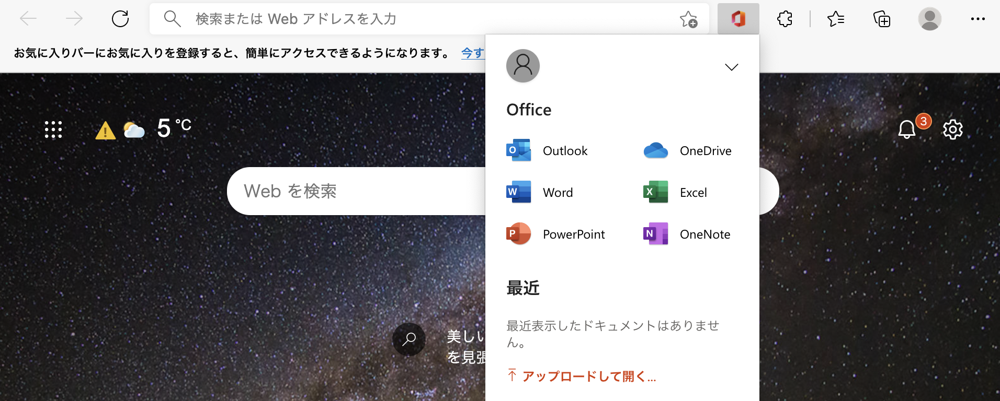

