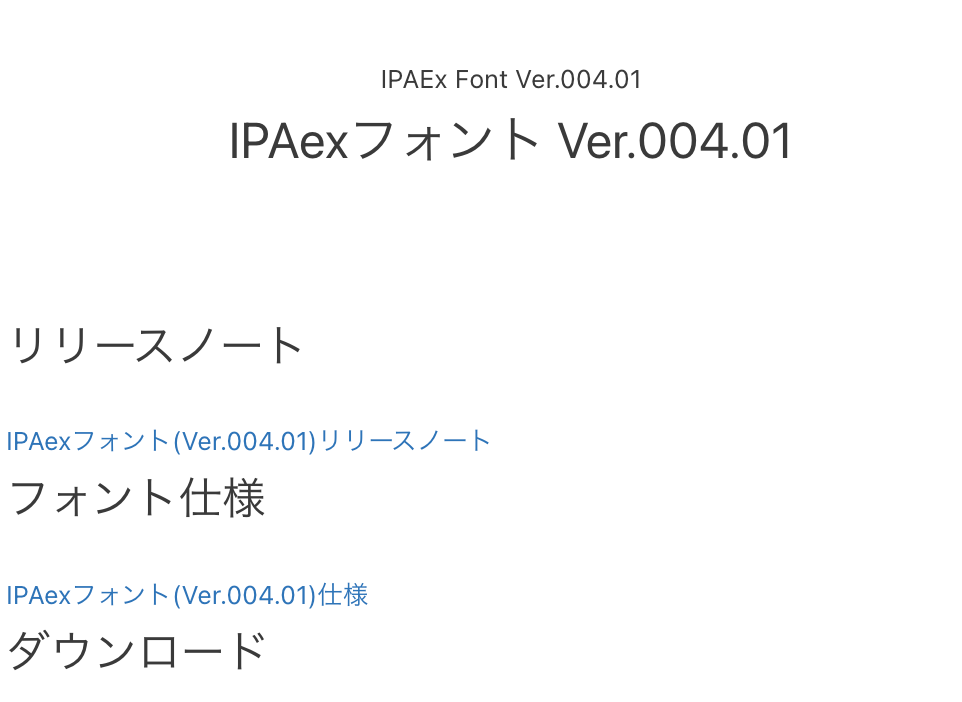
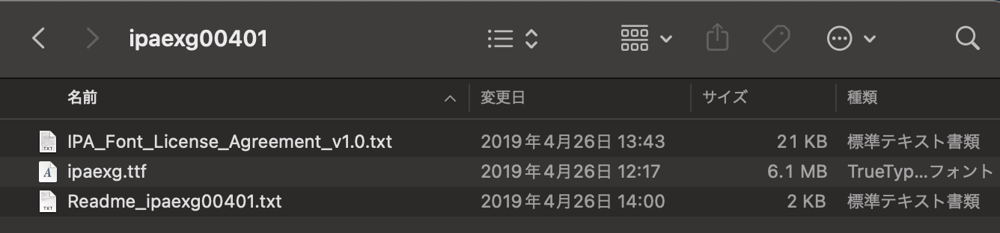
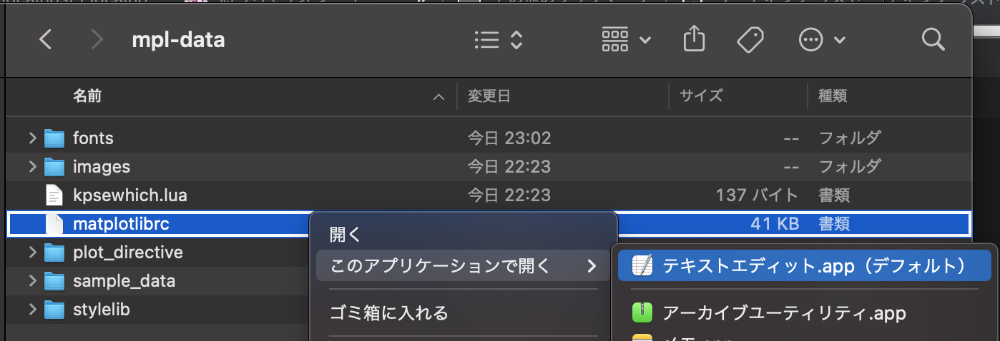
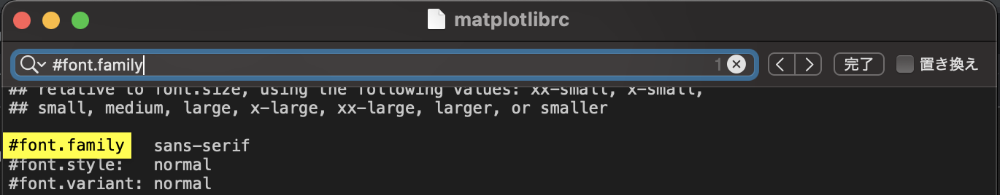
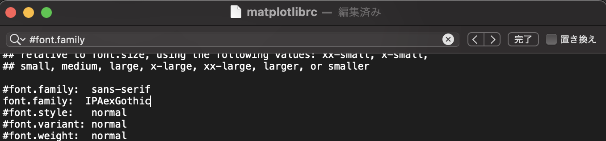
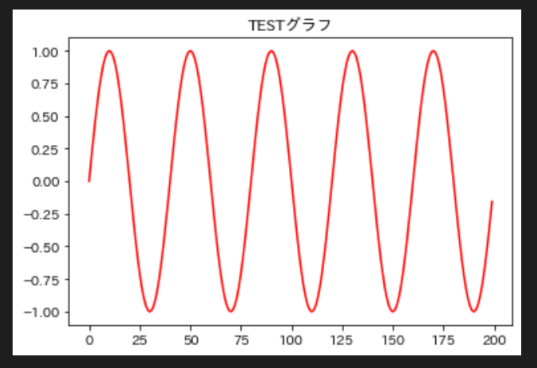

- [Matplotlibの日本語化](#matplotlibの日本語化)


# Matplotlibの日本語化

[参考にしたHPへのリンク](https://datumstudio.jp/blog/matplotlib%E3%81%AE%E6%97%A5%E6%9C%AC%E8%AA%9E%E6%96%87%E5%AD%97%E5%8C%96%E3%81%91%E3%82%92%E8%A7%A3%E6%B6%88%E3%81%99%E3%82%8Bwindows%E7%B7%A8/)

-  ipafontのダウンロード
- IPAexフォント(Ver.004.01)仕様をダウンロード


ダウンロードしたzipファイルを解凍すると、ipaexg.ttfというファイルがあります。


このファイルを、matplotlibのttfフォントのフォルダにコピーします。
```python
$ cp ipaexg.ttf /Users/niko/Desktop/MyApp/study/python/environment_3_9_7/bin/python3.9/site-packages/matplotlib/mpl-data/fonts/ttf
```

matplotlibrcをテキストエディットで開く
```python
/Users/niko/Desktop/MyApp/study/python/environment_3_9_7/bin/python3.9/site-packages/matplotlib/mpl-data/matplotlibrc
```


command + F で検索 '#font.family'


上の行をコピペして、ペーストした分を `font.family:  IPAexGothic` と書き換える。`#`はいらない


ここで設定はできたけど、キャッシュが残っててエラーになるので、
対話モード(ターミナルで`python`と入力)で、キャッシュがどこにあるか探す
```python
% python
>> import matplotlib
>> from matplotlib import rc
>> print(matplotlib.get_cachedir())
/Users/niko/.matplotlib
```
'/Users/niko/.matplotlib'に、'fontlist-v330.json'がふたつあったので削除。

あとは再読み込みして、セルを再度実行したら日本語になっている！

matplotlibが日本語になっているかテストしてみる
```python
import numpy as np
import matplotlib.pyplot as plt

s = np.sin(np.pi*np.arange(0.0, 10.0, 0.05))
t = plt.plot(s, color="r")
plt.title("TESTグラフ")
plt.show()
```


Matplotlibの日本語化 完成
___

